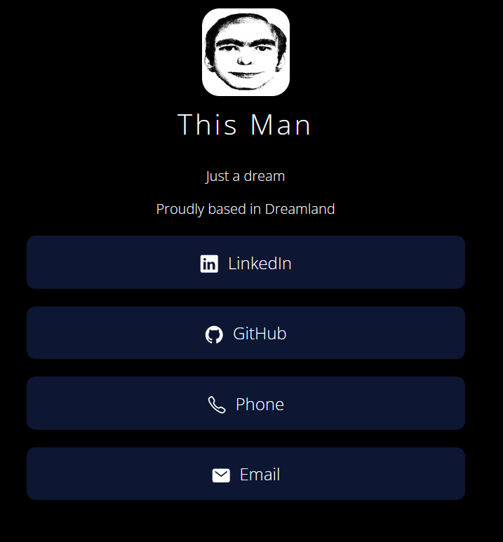

# LinkFree Profile Page Generator

## What this is:
A PowerShell script that generates a simple, responsive HTML profile page with embedded social media links and profile picture. Perfect for creating a personal landing page or digital business card.

## What this isn't:
This is not some massive, sprawling Linktr.ee replacement. Its a very simple site with very simple hopes and dreams.

## Features

- 🖼️ **Base64 Image Embedding** - Profile pictures are converted and embedded directly into the HTML
- 🌐 **Social Media Integration** - Support for LinkedIn, GitHub, Email, and Phone links
- 🎨 **Modern Design** - Clean, dark theme with hover effects and responsive layout
- 🌍 **International Phone Support** - Automatic formatting for 13+ countries
- ⚡ **Single File Output** - Everything embedded in one portable HTML file
- 🔧 **Customizable** - Easy to modify colors, fonts, and layout

## Requirements

- PowerShell 5.1 or higher
- Valid image file for profile picture (JPG, PNG, GIF, BMP, WebP)

## Usage

### Basic Usage
```powershell
.\Generate-ProfilePage.ps1 -ProfilePicturePath "path\to\your\photo.jpg"

```

### Full Example
```powershell
.\Generate-ProfilePage.ps1 `
    -ProfilePicturePath "profile.jpg" `
    -Name "This Man" `
    -Description "Just a dream" `
    -City "Dreamland" `
    -LinkedInURL "https://linkedin.com/in/jessewolcott" `
    -GitHubURL "https://github.com/jessewolcott" `
    -EmailAddress "thisman@thisman.org" `
    -PhoneNumber "5551234567" `
    -PhoneCountry "US" `
    -OutputPath "index.html"
```


## Parameters

| Parameter | Required | Default | Description |
|-----------|----------|---------|-------------|
| `ProfilePicturePath` | ✅ Yes | - | Path to your profile picture |
| `Name` | ❌ No | "Your Name" | Your display name |
| `Description` | ❌ No | "Your Description" | Brief description or tagline |
| `City` | ❌ No | "Anywhere, USA" | Your location |
| `LinkedInURL` | ❌ No | - | Your LinkedIn profile URL |
| `GitHubURL` | ❌ No | - | Your GitHub profile URL |
| `EmailAddress` | ❌ No | - | Your email address |
| `PhoneNumber` | ❌ No | - | Your phone number |
| `PhoneCountry` | ❌ No | "US" | Country code for phone formatting (if not US) |
| `OutputPath` | ❌ No | "index.html" | Output HTML file path (Will output to $PSScriptroot otherwise) |

## Supported Countries

| Country Code | Country | Phone Prefix |
|--------------|---------|--------------|
| US | United States | +1 |
| CA | Canada | +1 |
| UK | United Kingdom | +44 |
| AU | Australia | +61 |
| DE | Germany | +49 |
| FR | France | +33 |
| ES | Spain | +34 |
| IT | Italy | +39 |
| NL | Netherlands | +31 |
| SE | Sweden | +46 |
| NO | Norway | +47 |
| DK | Denmark | +45 |
| FI | Finland | +358 |

## Troubleshooting

### Common Issues

**"Profile picture file not found"**
- Ensure the file path is correct and the file exists
- Use absolute paths if relative paths aren't working

**"The term 'param' is not recognized"**
- Make sure you're running from PowerShell (not Command Prompt)
- Check your execution policy: `Get-ExecutionPolicy`
- Set execution policy if needed: `Set-ExecutionPolicy RemoteSigned -Scope CurrentUser`

**Script won't run**
- Ensure the file is saved with `.ps1` extension
- Try running with: `powershell.exe -ExecutionPolicy Bypass -File .\Generate-ProfilePage.ps1`

## License

This project is open source and available under the [MIT License](LICENSE).

## Contributing

Contributions are welcome! Please feel free to submit a Pull Request.

## Credits

This wouldn't have been possible without:
    * Linktr.ee charging too much
    * Dot.cards charging too much
    * The amazing work of Michael Barney with [Linkfree](https://github.com/MichaelBarney/LinkFree) 

---

**Made with ❤️ and PowerShell**
